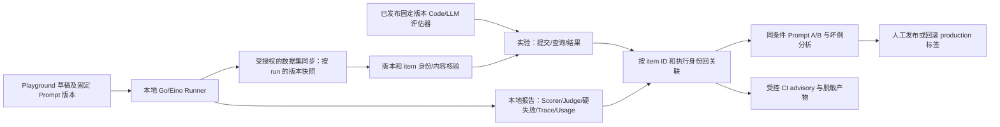

# CozeLoop Step 10–12 技术设计：实验、Prompt A/B 与受控 CI

| 项目 | 内容 |
| --- | --- |
| 状态 | Draft，供方案与实施计划 review；**不代表批准修改代码或平台已验收** |
| 日期 | 2026-09-28 |
| 适用范围 | **第一阶段：**Step 10–12 的接入实施与验收，及其正确性/安全性阻断项；**第二阶段**对全部 Step 1–12 代码做整体优化，见独立方案 |
| 关联文档 | [总体方案](cozeloop-platform-integration-technical-design.md)、[全链路进度与验收计划](cozeloop-completion-implementation.md)、[全链路代码优化方案](cozeloop-code-optimization-plan.md)、[评估器设计](../openspec/changes/add-cozeloop-evaluators/design.md)、[评估器验收](../evals/cozeloop/acceptance.md) |
| 证据等级 | 仓库代码 / 本地 fake HTTP / 目标 Workspace 实测分别记录；任何一级不能冒充下一级 |
| 待指定 | 技术负责人、Workspace 验收人、内容授权责任人、CI 可信环境管理人 |

## 1. 决策摘要与问题定义

**已与需求方对齐的边界：**① 先完成并在目标 Workspace 验收整个 CozeLoop Step 1–12 接入；② 接入完成后，对**全部 CozeLoop 实现代码**进行单独的整体优化评审，而不只处理 Step 10–12 的落地缺口（详见[代码优化方案](cozeloop-code-optimization-plan.md)）；③ 不扩展为无关后端重构。此前已确认：实验提交先走**独立命令**，使用已有本地报告及已同步数据，**不重新运行 Agent**；只有目标 Workspace 真正跑通才能认定实验接入完成。

当前 Step 1–9 已有代码骨架：可选 Client、Trace、PromptProvider、固定版本评测、本地 Runner/Scorer/Judge、run/case/repeat 身份、数据集同步及固定版本评估器工作流。但目标 Workspace 对 Prompt、评测集、评估器的实际字段与权限尚待核查，`evals/cozeloop/acceptance.md` 仍为 `workspace_verification=pending`。`--publish-cozeloop` 目前**仅同步数据集**，不是提交实验。

需要解决三类独立问题：

1. **Step 10：**从已同步、可核验的运行快照和已发布评估器创建实验，安全地查询结果并回关联到本地执行；遇到不支持的实验模式、部分结果或不可判定的提交结果时停止，而不是伪造成功。
2. **Step 11：**只改变 Prompt Version 的两次真实运行做逐 case 对齐，质量、成本、延迟与坏例综合比较；留存人工决策，绝不自动把平台分数或 production 标签变成发布事实。
3. **Step 12：**普通 PR 保持离线；在可信环境、固定版本、足够授权和可用凭据下进行可选 live + 实验；区分“跳过”“本地质量失败”“平台失败”，保留可审计且安全的报告。

若缺少真实实验 API 权限、无评测对象实验不可用，或者字段无法可靠对齐，**Step 10–12 的平台闭环不成立**；允许本地评测和离线 CI 继续运行，但不得声称完整接入完成。

### 1.1 能力地图、依赖方向和非目标

| 稳定能力 ID | 责任和可独立验收的产物 | 前置依赖 |
| --- | --- | --- |
| `experiment-link` | 契约探测、固定版本引用、独立提交/查询、逐项回关联与验收证据 | Step 6–9 的报告、已同步数据集及评估器版本 |
| `prompt-ab` | 两运行可比性校验、逐 case 差异、总体分析和人工决策记录 | `experiment-link`；没有平台实验时只能形成“本地比较”，不得称平台 A/B 闭环 |
| `trusted-eval-ci` | 离线 PR 检查与可选可信 live/实验作业、状态和安全产物 | `experiment-link` 的固定版本契约；平台评分门禁还依赖人工校准与另行评审 |
| `cozeloop-hardening` | **仅接入期阻断项：**报告隐私、快照完整性、身份/错误正确性等 | 相应阶段验收前修复，不代表完成全部代码结构优化 |

建议顺序：阻断项和 Workspace 探测 → `experiment-link` → `prompt-ab` → `trusted-eval-ci` → 全链路验收/基线冻结 → [Step 1–12 整体代码优化](cozeloop-code-optimization-plan.md)。各能力先形成独立 OpenSpec requirements/design/tasks，并在 review 后逐步实现；本文是接入决策草案，不替代后续结构优化方案或可执行 spec。

**不做：**在平台部署或暴露 Agent Endpoint；将工具 schema、工具循环限制或记忆写入规则移入 Prompt；从持久化报告重建真实回答；重跑 Agent 以补实验数据；让平台 LLM 分数覆盖本地硬失败；自动切换 production 标签；未校准先开启平台评分硬门禁。

## 2. 当前实现审查：事实、风险、修复优先级

以下是静态检查发现的**接入验收阻断项或直接依赖问题**，不等同于线上故障确认，也**不是全部 CozeLoop 代码的优化清单**。对配置、Trace、Prompt、评测、CLI、报告等完整实现的结构评估和接入完成后的优化顺序，见[全链路代码优化方案](cozeloop-code-optimization-plan.md)。任何阶段都应保留已有 Step 6–9 未提交改动。

| 优先级 | 代码依据和已观察事实 | 风险及拟修复方向 |
| --- | --- | --- |
| P0 | `backend/internal/eval/model.go` 的 `CaseResult.Answer` 不序列化，但 `ToolTrace.Arguments`、`Error`、Judge rationale 会随报告 JSON 持久化；`backend/internal/eval/report.go` 会生成 summary；`.github/workflows/evaluation.yml` 上传 `evals/reports/` | “不存回答”不等于报告可公开。审计报告字段并将本地受限原件与 CI **白名单脱敏摘要**分离；不要把原始 Tool Trace、错误或理由直接发布为 artifact。修复前不启用含真实用户内容的 CI 上传。 |
| P0 | `backend/internal/eval/dataset_sync.go` 的 `compareDatasetItems` 只核对预期项，未拒绝额外项；当前数据集可能包含其他 run 的 item | 如果版本快照含额外项，实验可能评估混入的运行。逐版本比对**精确 item 集**、完整 `result_identity` 和 run 归属；不能证明快照隔离时拒绝提交。验证实际平台的版本创建范围，必要时改变按 run 隔离策略。 |
| P0 | `backend/internal/infrastructure/cozeloop/evaluation_client.go` 在远端字段 `content_omitted=true` 时不重新计算内容哈希；已同步报告只有 dataset/version ID，没有完整已验证的 item ID 映射 | 不能把“远端自报哈希”当作内容一致的充分证据。区分“可读已核验”“被省略不可核验”，对用于实验的版本要求可验证的 item ID↔本地执行身份映射或目标 Workspace 验证过的等价可信机制；不可核验时 fail closed。 |
| P1 | `backend/internal/eval/report.go` 的发布资格没有显式比较 requested/resolved 的 Prompt Key、Workspace、具体 Version 与内容 hash；`backend/cmd/eval/main.go` 的 `--require-prompt-version` 在启动前主要验证配置 | 对每一条有效执行校验实际解析版本及内容一致性，不把配置上的固定版本当作真实生效版本；版本或来源缺失即不可发布、不可纳入可比 A/B。保留现有 strict Provider 和本地关键失败约束。 |
| P1 | `backend/cmd/eval/main.go` 仅 `--publish-cozeloop` 时把报告放到 run_id 子目录；普通 live 默认覆盖同目录 `report.json` | 所有 live run 统一按 run_id 隔离，或在 A/B 前强制独立输出目录；不覆盖旧 run。迁移已有命令用法和测试时保持兼容。 |
| P1 | `backend/internal/eval/model.go` 报告没有实验状态、评估器版本引用及 A/B 的模型参数、工具/上下文策略快照；`runner.go` 的 `DurationMS` 包括 Judge 阶段 | 为实验另存可版本化元数据/侧车文件；A/B 将 Candidate 耗时与整次 case 耗时分开，不把后者误称模型延迟。当前缺失的控制变量按“不可比较”处理。 |
| P1 | `backend/cmd/eval/main.go` 用错误文本匹配判定授权撤销/失败类别；`report.go` 可将原始 `CaseResult.Error` 写入 summary；`.github/workflows/evaluation.yml` 将 smoke 错误转为 warning，CLI 即使 case failed 也可能成功退出 | 改为不包含敏感响应的**类型化错误/状态**；CLI 明确区分命令执行、评测质量、平台上传三类退出或产物状态；可信 CI 不凭单个退出码推断质量通过。 |
| P2 | `backend/internal/eval/evaluator.go` 已有固定版本/内容 hash 查验，但并发发布依赖共享 draft 与读回，不能视为原子提交 | 同一 evaluator 发布串行化；实验仅引用读回匹配的已发布版本。若 Workspace 无条件写入能力，避免并发 publish，不把实验提交顺便做资源变更。 |
| 保留 | `EvaluationPlatform` 和 `EvaluatorPlatform` 已各自隔离领域 port 与 HTTP DTO；本地 Scorer/Judge 独立；内容上传有独立开关和授权复核 | 不把多个领域接口合成“万能 Client”，不让 OpenAPI DTO 进入业务层。新增实验 port，尽量复用底层 HTTP 安全与授权能力，但请求按实际载荷分类。 |

## 3. 端到端闭环与权威边界



**权威来源：**本地 Runner 的执行状态、确定性检查、基础设施无效计数及 `ReleaseEligible` 保持权威；CozeLoop 评估器提供版本化附加判断，未经 10–15 个 case 人工校准的 LLM 分数始终 advisory。平台返回缺项、空 score/reason 或聚合延迟不能覆盖本地结论。Prompt Playground 不替代完整 Tool Loop/SQLite fixture 的 Runner 验证。

**闭环验收是联合条件：**固定 Prompt 真正解析 → 同一 run 关联 Candidate/Judge Trace 与 Usage（不存在则明示 unavailable）→ 数据集内容/身份及快照可验证 → 固定评估器可执行 → 平台实验完成且逐项回关联 → 同条件 A/B 可审计 → 经授权的可信 CI 能产出正确状态 → 人工发布与回滚留证。只满足其中一段不能称“整个 CozeLoop 已闭环”。

## 4. 公共契约与 Workspace 验证矩阵

公开服务端 [Evaluation OpenAPI IDL（固定 commit）](https://github.com/coze-dev/coze-loop/blob/f27d2fb2/idl/thrift/coze/loop/evaluation/coze.loop.evaluation.openapi.thrift) 声明 `POST /v1/loop/evaluation/experiments`、`GET /v1/loop/evaluation/experiments/:experiment_id`、`POST /v1/loop/evaluation/experiments/:experiment_id/results`、`POST /v1/loop/evaluation/experiments/:experiment_id/aggr_results`。`SubmitExperimentOApiRequest` 有 `eval_set_param`（数据集 ID + **版本字符串**）、`evaluator_params`（评估器 ID + **版本字符串**）、可选 `eval_target_param`、`target_field_mapping`、`evaluator_field_mapping`；结果列表按 `page_num/page_size` 分页。[实验领域 IDL（同 commit）](https://github.com/coze-dev/coze-loop/blob/f27d2fb2/idl/thrift/coze/loop/evaluation/domain/expt.thrift) 的逐项结果有 `item_id`、`turn_results`、评估器记录，状态区分 Pending/Processing/Success/Failed/Terminated 等。

这些仅证明**某一公开源码版本**存在字段/路由；不证明目标 Workspace 有权限、允许省略评测对象，或 Code/LLM evaluator 能从数据集的 `actual_output` 直接消费已有 Candidate 结果。尤需注意：CozeLoop Code evaluator 的 `actual_output` 在现有 Debug 中属于 `evaluate_target_output_fields`；无 target 的实验能否将其映射自评测集 `actual_output`，以及 LLM 输入字段如何映射，必须真实试验。不得把一个未提供目标的请求返回 2xx 当作正确执行。

**非敏感 PoC（在实现 Step 10 前记录）：**

| 检验 | 目标 Workspace 证据 | 不通过时 |
| --- | --- | --- |
| 权限和路由 | 使用专用测试数据核对创建、详情、分页结果、聚合接口的权限、状态码与字段 | 停止实验 adapter 上线，维持本地评测 |
| 无评测对象运行 | 提交只有数据集版本 + 已发布评估器版本的实验；检查是否真的运行并完成 | 暂停 Step 10，评审是否接受自定义评测对象/其他回流路径；**不静默切换** |
| 字段映射 | 分别证明 Code 的 `actual_output` 和四项 LLM 的声明字段取自正确的数据集值；核对 score/reason | 先修订 spec/映射；不能将空分当 0 或跳过 |
| 快照与身份 | 两个 run、重复索引、重传、部分写入：核对版本 item 集、`item_id`、结果归属及版本字符串 | 建立可验证的 run 隔离/外部键策略后再提交实验 |
| 幂等与未知提交 | 模拟超时/丢失 POST 响应、重试；检查是否能凭已有 ID 或可检索的稳定外部键找回 | 未知提交进入人工核对，不盲目重新 POST；不能承诺 exactly-once |
| 内容安全 | 记录请求载荷类别、授权撤销后续请求、Token/响应错误脱敏与受限证据 | 禁止携带内容操作，保留本地结果 |

PoC 记录目标 Workspace 标识（可脱敏）、时间、接口/版本、非敏感请求形状、实验/数据集/评估器 ID、结果摘要及受控证据引用；不得把凭据、Prompt/回答原文粘进仓库。若实测与固定 IDL 不一致，以 Workspace 行为修订 OpenSpec，不反过来伪称 API 已验收。

## 5. Step 10：独立实验提交与结果回关联

### 5.1 组件与依赖边界

- **本地领域编排：**建议在 `backend/internal/eval` 定义单一用途 `ExperimentPlatform` port、实验请求/状态/逐项结果，以及“校验报告 → 校验同步版本 → 校验评估器 → 提交/恢复 → 轮询/分页 → 回关联”的服务；只使用领域 ID/版本/身份，不直接暴露 CozeLoop HTTP DTO。
- **平台适配：**`backend/internal/infrastructure/cozeloop` 单独封装实验路由、字段映射、分页限制、同源/HTTPS、超时/取消、凭据过滤、逐请求内容授权。复用现有安全 HTTP 构件前先核实是否需要抽取共享 transport，避免拷贝三份安全规则。
- **命令入口：**新增独立实验命令；输入为**已存在** `report.json`、已同步数据集引用和评估器版本清单；绝不调用 Candidate/Judge Runner。接口示意（**提议，非现存命令**）：`cozeloop-experiment submit --report <path> --evaluators <manifest> --apply [--wait]`，及 `cozeloop-experiment reconcile --report <path> --experiment-id <id>`。实际参数、是否需要明确 `--apply` 与输出格式先由 OpenSpec 定稿。
- **持久状态：**不修改本地质量分数；实验关联和回查状态采用与报告同 run 目录的受限侧车文件（或报告的向后兼容版本扩展，由 Step 10 spec 定义）。保留旧报告可读、保留原报告/实验错误分层，失败不删除已知的实验 ID。

### 5.2 身份与不变量

| 对象 | 约束 |
| --- | --- |
| case 定义 | `case_id + case_version`；不是运行实例 |
| run | 每次 live run 独立 `run_id`；同 commit/model/prompt 再跑仍是新 run |
| 执行 | `run_id + case_id + case_version + repeat_index`；一次 run 内不可重复 |
| 数据集 | 已同步的 `dataset_id` + **不可变版本 ID/版本字符串** + 版本完整 item 集；不得用 latest 或当前工作副本 |
| 评估器 | 每个逻辑 key 精确匹配 Workspace evaluator ID + 已发布的不可变版本/版本 ID + 本地内容 hash；不能用 draft/标签/latest |
| 实验意图 | `workspace + run_id + dataset/version + evaluator versions + field mapping + mapping schema` 的规范化指纹；**不是平台已支持的原生幂等键** |
| 逐项关联 | 读取版本快照建立 `item_id -> result_identity` 映射；结果需能回查相同 item ID 和 turn 身份，不能只看数组顺序或 case ID |

提交前校验：本地报告为 live、run 身份/重复索引完整且唯一；`CozeLoopSync.Status=synced` 且引用同 Workspace 的版本；核对该版本的 item 集与报告执行集**完全相等**，字段/内容可验证、版本身份与 run 一致；评估器版本已读回匹配，字段映射仅含资产所声明字段；遇到 infrastructure failure 的 case **不悄悄删除**，需按 PoC 确认是平台标记 invalid/实验中隔离还是阻断整次提交，并保留原始总数。无法获取真实 Candidate 输出时只能引用远端已有版本，不从报告恢复 `Answer`。

**提交语义（提议）：**

```text
本地校验完成 → 已记录待提交意图 → 发起一次远端 POST
    ├─ 拿到 ID → 持久化实验引用 → 查询状态 → 分页取结果 → 对齐/核验 → 完成
    ├─ 明确拒绝 → 记录安全分类和可修复原因，不改变本地报告
    └─ 超时/断连/进程崩溃且无法证明未提交 → unknown，停止自动重复 POST，人工或可验证的查询方式恢复
```

同一 run + 相同指纹再次执行只查询已知实验 ID；指纹变化拒绝原 run 覆盖。若实际平台能提供可靠且唯一的外部键或按名称精确检索，先通过 Workspace 证明再设计自动恢复；没有则只承诺**发现不确定性并避免盲重试**，不承诺 exactly-once。创建后读回并检查数据集/评估器/映射，不能只信 2xx。禁止同一 run 并发提交；先实现本地互斥/状态写入原子化，但不能把本地文件锁当跨机器分布式幂等。

**轮询与结果：**状态使用显式枚举，`Pending/Processing` 有截止时间、退避、取消与预算；`Failed/Terminated` 保留分类、ID 和未完成项；`Success` 仍要检查分页完整、total/重复 item、每个执行身份及所有评估器的分数/理由。平台部分完成、缺失、重复、冲突或空结果均标为 incomplete/reconcile_failed，不生成质量通过结论。平台聚合值只能作展示，基于逐项有效性重新核对分母；绝不可把缺失值当 0 或剔除坏例后宣称胜出。实验 URL 仅用验证过的 Workspace 规则构造，未知时只显示 ID，杜绝 URL 注入和携带 Token。

### 5.3 实验侧车（建议逻辑契约，具体 schema 在 spec 定稿）

```text
schema_version, run_id, workspace_ref, dataset_id, dataset_version_id/version,
evaluator_refs[{key,id,version_id/version,content_hash}], mapping_fingerprint,
request_fingerprint, experiment_id?, lifecycle_status, safe_error_category?,
item_bindings[{item_id,result_identity}], observed_counts, last_checked_at?, evidence_ref?
```

只存最小审计元数据；不存 case 原文、回答、工具参数、Prompt、Token 或未经脱敏的远端错误。侧车与本地报告之间用 run_id、预期集合/摘要互验，避免将旧 run 的成功实验贴到新报告上。文件持久化必须限定路径、原子更新、受限权限/Windows ACL，防止同名覆盖和并发写；对不可信本地输入设大小与结构上限。

## 6. Step 11：Prompt A/B 与可审计发布决策

### 6.1 可比性的真正含义

A、B 分别执行固定 Prompt vA/vB，得到**两个不同 run 和两份含不同 actual_output 的数据集版本**；“相同评测集”指相同的**case 定义、版本、样本/repeat/fixture 及评估规则**，不是复用同一包含 Candidate 输出的数据集版本。两侧需固定：Git commit、Candidate/Judge 模型与重要参数、工具注册/版本、Context 策略、timeout、fixture/输入、评估器精确版本/内容 hash 和字段映射；记录环境差异。唯一期望变化是主 Agent Prompt Version。若 Judge/摘要 Prompt 也参与执行，其版本必须固定且可审计。

A/B 运行清单建议记录：左右 run/report/实验引用、case manifest/hash、repeat/筛选规则、固定控制变量与实际解析 Prompt 元数据。重复运行需匹配 `(case_id, case_version, repeat_index)`，左右执行身份仍各自包含不同 `run_id`；同一 case 的多次 repeat 不合并为一次。任何一侧数据缺失、基础设施失败、未评分、平台 incomplete、Prompt fallback 或版本不一致，均列入对照表并阻止“可发布胜者”判断；允许展示局部参考指标，但标注分母及不可比原因。

### 6.2 指标、坏例和决策

- **质量：**本地 hard failure、确定性分、Judge 分和 release eligibility 单独呈现；CozeLoop Code/LLM 各维度分数与 reason 作版本化补充。展示逐 case Δ、有效/无效数量、通过/失败、均值/分布及维度差异，不只看一个平均分。
- **成本：**Candidate/Judge Usage 分开、缺失为 unavailable 而非 0；总 Token 与单次执行的统计分母显式标注。未有可靠价格/模型价格版本前不伪造货币成本。
- **时延：**优先区分 Candidate 时延、Judge 时延和全 case 耗时；现有 `DurationMS` 含 Judge，不能直接用作 Candidate 延迟。展示样本量和分位指标，避免小样本误读。
- **坏例：**逐 case 列出 A/B 的本地结论、平台失败/缺项和受控 Trace 引用；原始回答只在有授权的 Workspace 或受限本地来源查看，不进公开报告。
- **发布：**仅在两侧可比、本地发布资格符合既定门槛、人工检查差异并签署决定后手动移动 production 标签；记录审批人、时间、目标版本、证据引用和旧版本。回滚手动把标签指回旧版本，必要时停止线上 Prompt 开关；不删除既有报告或实验。

质量增益/成本/时延的可接受阈值、repeat 数、样本选择、校准误差与审核责任人**尚待产品/技术共同确定**。在这些阈值未批准前，比较工具输出事实和差异，不能自动宣判获胜。平台 LLM 分数在 10–15 case 人工校准复核前不做硬门禁。

## 7. Step 12：可信 CI、内容治理与失败语义

| 场景 | 运行内容 | 结果语义 |
| --- | --- | --- |
| 普通 PR（含 fork） | 仅离线 Go tests、数据集/Playground/评估器 manifest 校验、fake/单元测试；不暴露平台或模型凭据 | 无 Workspace 不影响 PR；不要在 PR job 加 `pull_request_target` 等可能执行不可信代码并读取 secrets 的配置 |
| 现有 advisory smoke | 非 PR 的可选本地 live；单独标记是否缺模型凭据、是否未评分、是否无报告 | 保留现有实验前的基线能力，但不能称“固定版本发布验证” |
| 新增可信固定版本评测 | 受保护环境的手工触发或审过的主分支任务；明确 Prompt Version、Judge 依赖、run 参数和产物受控目录 | 严格解析失败/基础设施无效不得视为质量通过；在模型初始化前失败也要有安全状态记录 |
| 可选平台实验 | **仅当**有已批准的非交互授权机制、同 Workspace 的有效内容授权/开关/凭据、Step 10 Workspace 验收通过时提交已有 run 实验 | 没有授权或 Secrets 时明确 skipped；平台错误与本地质量失败分开；禁止 CI 自动生成伪用户授权记录 |

当前 `cozeloop-consent grant` 通过交互确认写本地授权文件，且绑定 Workspace 和 API 地址；它**不是** CI 的通用授权机制。是否允许上传 fixture/真实数据、谁授权、如何为短生命周期 runner 安全提供和撤销授权、数据保留/访问策略，需另行安全与合规 review。未形成经批准的非交互方案前，CI 的平台实验段必须关闭或显式跳过；“有 API Token”不等于有内容授权，`COZELOOP_CAPTURE_CONTENT` 也不等于评测授权。元数据接口如果实际携带 Prompt/用户内容，应按内容接口检查，不能按 HTTP 方法简单豁免。

**CI 输出建议：**机器可读结果分别表示 `execution_status`（本地执行）、`quality_status`（本地质量）、`platform_status`（未启用/跳过/失败/已核验）、`eligibility_status`（发布资格），且保留 job/artifact 的对应引用。只对白名单字段生成安全摘要（run/版本/计数/安全错误类别/受控链接），不要直接上传 `evals/reports/` 下全部 JSON/Markdown；对失效链接/非授权人员，链接也不应暴露私有内容。定义 artifact 保留期和访问权限。平台失败不得冒充通过；初期仍可作为 advisory 与主质量检查解耦。将平台评分升级为硬门禁必须在 Workspace 验收、人工校准、阈值和故障豁免策略单独 review 后另行实施。

## 8. 跨阶段安全与可靠性要求

1. **权限/隐私：**按内容而非路径分类：数据集写入、实验 POST（若含输入/映射常量）、Validate/Debug、结果读回及本地报告产物都可能含用户材料。发送前逐请求确认开关、当前授权、Workspace/API 地址与范围；授权撤销立即阻止后续上传和 pending 重试，已上传内容不会由本地撤销自动删除。
2. **最小化：**工具轨迹上传只留工具名、空 arguments 对象与脱敏错误；同时审查 fixtures、参考事实、Judge 理由及 evaluator 资产是否含敏感内容。凭据、原始平台错误、用户材料不能流入日志、URL、受控证据记录或 CI artifact。
3. **重试：**只重试已确认安全的只读查询或具有真实幂等保证的操作；写操作响应丢失时记录 unknown，不把“相同请求指纹”误称平台原生幂等。防止并发发布与并发同 run 实验。
4. **边界：**请求时间预算、分页总页数/总条数、响应体上限、同源重定向、HTTPS（本地 loopback 除外）、取消传播，沿用并统一现有适配器安全规则；长实验使用短请求 + 有上界轮询，不把整个生命周期塞进单个 HTTP 超时。
5. **回滚：**独立关闭 Trace/Prompt/Evaluation/实验/CI 相关开关，不影响本地 Runner。Prompt 的 production 标签人工回滚；实验提交失败或已创建后关闭开关时，保留元数据和已知 ID，不重写本地报告/硬失败，平台已有内容按 Workspace 策略单独处置。

## 9. 实施计划、依赖与 review 门槛

以下是**拟议任务及验收**，不是已经授权的代码变更。每个阶段先建或更新独立 OpenSpec（proposal/spec/design/tasks），review 后再单独确认改代码。Step 8–9 评估器 Workspace 验收仍是前置，不可用“本地任务已勾选”替代。

| 阶段 | 交付 / 建议代码落点 | 验收及停止条件 |
| --- | --- | --- |
| 0. 契约 PoC 与 spec | 对目标 Workspace 用授权的测试数据验证 §4；维护 Step 10 OpenSpec，确定无 target 模式、字段/身份、CLI 与授权方案 | 记录真实接口证据；失败即停下修改实验模式的决定，不宣称闭环 |
| 1. 阻断式框架优化 | `backend/internal/eval` 的快照/报告边界；`backend/internal/infrastructure/cozeloop` 的读取核验和错误分类；`backend/cmd/eval` 的 run 输出隔离；CI 的安全摘要 | 快照集合、内容/身份无法核验时 fail closed；旧报告兼容；报告/CI 不泄漏原始工具参数、理由和错误；本地评分语义不变 |
| 2. 实验提交 | 实验领域 port + 平台 adapter + 独立命令；报告旁的关联/恢复记录 | 固定版本和映射校验；提交/未知结果/并发/读回/轮询/分页/部分结果均可测试；真实 Workspace 完成逐 item 回关联 |
| 3. Prompt A/B | Step 11 OpenSpec + 两 run 对比清单、可比性判定与逐 case/总体差异报告 | 只变 Prompt Version；失败/缺项不被剔除；生产标签仍人工切换并能回滚 |
| 4. 可信 CI | Step 12 OpenSpec + `.github/workflows/evaluation.yml` 的离线/可信分流与白名单产物 | PR 无平台凭据；无密钥/无批准授权安全跳过；已批准可信作业能得到固定版本实验及脱敏产物；质量/平台失败明确区分 |
| 5. 闭环验收 | 更新 `evals/cozeloop/acceptance.md` 和发布操作说明，复核 Step 1–12 | 按层标记已验证/失败/待验证；目标 Workspace 上完成 Prompt/Trace/评测集/评估器/实验/A/B/CI 证据链后才称“闭环” |

任务切片示例：`experiment-link` 分成领域契约与校验、平台 Submit/Read、结果分页回关联、独立命令及续查、Workspace 验收；每片配单元/fake HTTP/真实平台中的适用证据。`prompt-ab` 分可比性契约与报告；`trusted-eval-ci` 分权限/产物策略与可信作业。避免一次性修改 Runner、评分器和所有 CLI。

### 9.1 验证矩阵

| 层次 | 必要用例与通过标准 |
| --- | --- |
| 单元 | 重复 run/case/repeat、版本缺失/漂移、哈希冲突、额外项/遗漏项、`content_omitted`、缺失 Usage、Prompt 实际版本不匹配、A/B 控制变量不等、错误分类和敏感字段脱敏 |
| Fake HTTP | 公开 IDL 路由/DTO/字段映射；无 target 的预期请求形状；提交响应丢失、拒绝、重复/并发；轮询取消/超时、分页上限、重复 item/空 score/reason；逐请求授权撤销与重定向/Token 过滤。此层**不证明 Workspace 支持该模式** |
| 目标 Workspace | 不含凭据的正反例证据：固定数据集版本与 item 集、已发布评估器版本、无 target 实验完成、逐项映射、两 run/repeat 隔离、失败恢复、A/B 对比及 Trace 关联；10–15 case LLM 校准单独记录 |
| CI | 普通 PR 离线通过；可信任务缺密钥/授权跳过；有效授权上传且能查询结果；初始化失败也有安全状态；artifact 经隐私检查；平台失败不会被误报成功 |
| 本地回归 | 在 `backend/` 运行 `go test -mod=readonly ./...`、`go vet ./...`；离线 evaluator validate；`git diff --check`。本设计阶段不需要启动前端 |

## 10. 风险、替代方案及待决问题

| 风险/替代方案 | 处理 |
| --- | --- |
| 目标 Workspace 不支持无评测对象实验，或把 target 字段当必需 | 停止 Step 10 实现与上线；评审 A：继续保留本地回流、仅使用平台数据集/评估器调试；B：单独规划自定义评测对象 Endpoint（需鉴权、部署、成本、授权），**不在本方案内自动采用** |
| 平台版本快照含其他 run/部分字段被隐藏 | 要求隔离且可核验的快照；无法核验则阻断提交，不靠过滤结果补救已污染实验 |
| POST 响应丢失、平台没有唯一外部键/查找能力 | 记录 unknown 和人工恢复；优先真实验证查询/唯一约束，不能承诺 exactly-once |
| 平台 LLM 评分漂移、成本增加 | 固定版本/模型配置、限量 smoke 与并发，人工校准；本地硬规则持续权威 |
| CI 内容授权与原始报告隐私冲突 | 默认关闭上传；经治理批准才上可信作业；只发布白名单摘要，严格限制原始报告访问/保留 |

**待 review 的具体决策（未获答复前不得默认为通过）：**

1. 谁提供目标 Workspace、测试数据、API 权限和可审计证据？Step 8–9 真实发布及人工校准由谁签署？
2. 无评测对象实际运行及 `actual_output` 的 `from_eval_set` 映射、版本快照和 `item_id` 的真实语义是什么？不支持时选择暂停还是另立方案？
3. 是否允许在 CI 上传 fixture 或真实 case；何种主体能合法批准非交互内容授权、撤销及 artifact 保留期？在此决定前平台 CI 不启用。
4. A/B 的 case 子集、repeat 次数、模型参数快照、质量/Token/时延阈值与坏例审核人是谁？如未定义，仅生成比较数据，不自动定胜负。
5. 现有报告的原始工具参数/错误/理由是否需要保留为受限原件？CI 和人工审阅分别允许看到哪些字段？

**下一步 review 门槛：**先确认本接入能力地图、阻断项处理和待决问题，并同时 review [全部 CozeLoop 代码的优化目标与切片](cozeloop-code-optimization-plan.md)。接入与整体结构优化分别制定 OpenSpec requirements/design/tasks；接入完成、Workspace 验收和基线冻结后再展开非阻断性的全面重构。各 spec review 通过并经单独确认后，才逐阶段修改代码。
